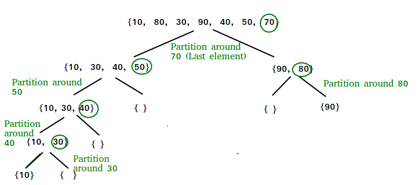

# 5. Quick Sort

## About the Problem

Quicksort is a sorting algorithm that uses a divide and conquer strategy;

It:
  - Takes in an array.
  - Picks a value in the array as a pivot.
  - Partitions all the elements of the array into two arrays, based on
    - if they are larger or smaller than the pivot.
  - Recursively sorts the two halves.
  - Combines the two arrays and the pivot into a sorted array.



### Examples

| Example| Input | Output |
| --- | --- | --- |
| 1 | `[10, 80, 30, 40, 50, 70]` | `[10, 30, 40, 50, 70, 80]` |
| 2 | `[9, 6, 3, 7, 2, 12, 5, 1]` | `[1, 2, 3, 5, 6, 7, 9, 12]` |

## <a href='./quickSort.js'>About the Solution</a>


<!-- Add Time and Space Complexity -->
### Time and Space Complexity
  - Time Complexity: `O(n)`
  - Space Complexity: `O(n)`

<!-- Planning -->
### Input, Output, Constraints, Edge (IOCE)

  - I:
  - O:
  - C:
  - E:

### Strategy
-

### Pseudocode
-

## <a href='./quickSort.test.js'>About the Tests</a>


Test cases are run through the LeetCode platform and locally with Jest using:
```
npm run test
```